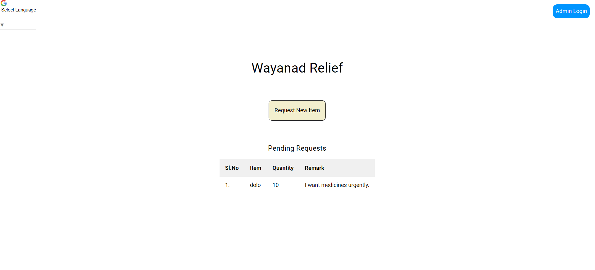
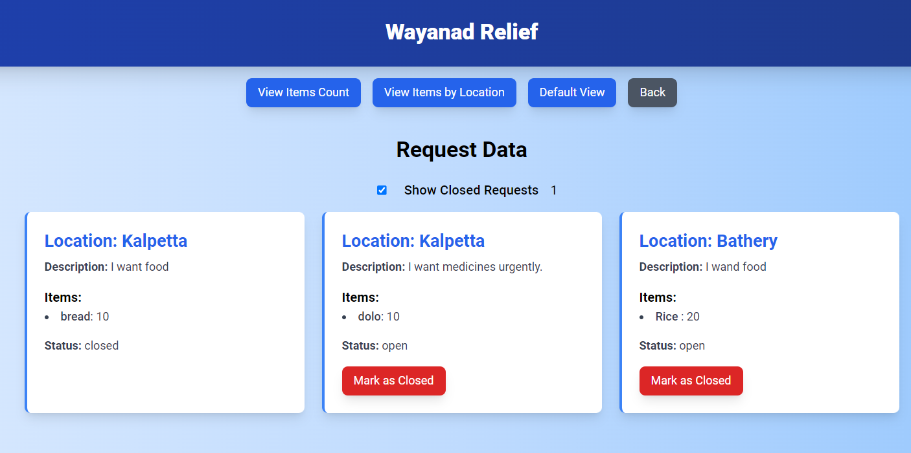

# Wayanad Flood Relief Portal

A basic web platform designed to streamline the submission and management of requests for assistance during the Wayanad floods. The portal is built with inclusivity and ease of use in mind, providing essential functionalities for both individuals in need and administrators managing the relief efforts.

## Features

### Easy Request Submission
Individuals in need can easily submit requests for assistance, ensuring their needs are promptly heard.

### Admin Portal
Admins can filter data by location and quantity, and mark requests as closed once assistance is provided. This ensures efficient management of resources and quick response to those in need.

### Multi-Language Support
Breaking down language barriers, the portal is accessible in multiple languages, ensuring inclusivity for all communities.

## Technology Stack

### Firebase
Firebase was used as a lightweight backend for quick implementation and endless functionalities, providing a scalable and reliable platform for the application.

### Google Translate API
The Google Translate API was utilized for translating languages in the inventory management system, enabling seamless communication across different languages.

## Interface

## How to Use

1. **Request Submission**: Individuals can easily fill out a form with their specific needs and submit it directly through the portal.
2. **Admin Management**: Admins can log into the portal, filter requests based on various parameters, and manage the status of requests efficiently.

## Contributing

We welcome contributions from the community. Feel free to submit issues or pull requests to help improve this portal.

## License

This project is licensed under the MIT License - see the [LICENSE](LICENSE) file for details.
